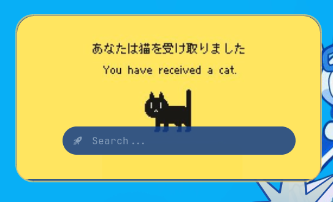
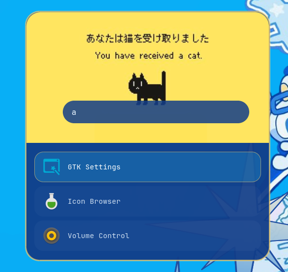

# [[ ✩ DOTS BY DIZZY  ✩ ]]

**A minimal but stylish Rofi App Launcher**

>Designed to be toggled open/closed from Polybar

___________________________________________________________________
> [!IMPORTANT]
> **Required**
> - Rofi
___________________________________________________________________






___________________________________________________________________

> [!TIP]
> You can edit the config to toggle from your own preferred task bar, this one is used by Polybar.

___________________________________________________________________

If you are also using Polybar, here is my Rofi Launcher Polybar Module:


**App Launcher - Rofi**


```[module/arch]
type = custom/script
exec = ~/.config/polybar/scripts/rofi-toggle.sh
tail = true
click-left = rofi -show drun -theme ~/.config/rofi/launcher.rasi &
label-foreground = ${colors.accent}
label-padding = 1
label-font = 6```


___________________________________________________________________


# OFFICIAL DOCUMENTATION


:gear: **ROFI REPO:**

:link: [Eww Repo Git Clone]([https://github.com/elkowar/eww](https://github.com/davatorium/rofi))

:gear: **ROFI DOCUMENTATION:**

:link:[Official Documentation]([https://elkowar.github.io/eww/](https://davatorium.github.io/rofi/))
___________________________________________________________________
